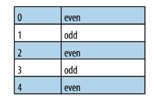

# 1.3 Selecting DOM Elements Using Selectors and the jQuery Function
```
<a href='#'>link</a>
<a href='#'>link</a>
<a href='#'>link</a>
<a href='#'>link</a>
<a href='#'>link</a>
<a href='#'>link</a>
```
> count how many time a tag occured 

```js
<script type="text/JavaScript">
//alerts there are 6 elements
alert('Page contains ' + jQuery('a').length + ' <a> elements!');
</script>
```
# 1.4 Selecting DOM Elements Within a Specified Context
```
<form>
	<input type = "checkbox"/>
    <input type = "checkbox"/>
    <input type = "checkbox"/>
    
</form>
<form>
	<input type = "checkbox"/>
    <input type = "checkbox"/>
    <input type = "checkbox"/>
    
</form>
```
```js
<script type="text/JavaScript">
//searches within all form elements, using a wrapper for context, alerts "8 inputs"
	alert('selected ' +jQuery('input',$('form')).length + ' 	inputs');
</script
```

# Filtering 

```
<a href="#" class="external">link</a>
<a href="#" class="external">link</a>
<a href="#"></a>
<a href="#" class="external">link</a>
<a href="#" class="external">link</a>
<a href="#"></a></li>
<a href="#">link</a>
<a href="#">link</a>
<a href="#">link</a>
<a href="#">link</a>
```

```js
<script type="text/JavaScript"
src="http://ajax.googleapis.com/ajax/libs/jquery/1.3.2/jquery.min.js"></script>
<script type="text/JavaScript">
//alerts 4 left in the set
alert(jQuery('a').filter('.external').length + ' external links');
</script>
```

> This will filter only `<a>` tag with `external_class`   

# Remove a dom element
```
<a href="#" class='remove'>Remove this</a>
```
```js
jQuery('a').remove('.remove');
```
# Replacing a Dom Elements
```
<ul>
<li class='remove'>name</li>
<li>name</li>
<li class='remove'>name</li>
<li class='remove'>name</li>
<li>name</li>
<li class='remove'>name</li>
<li>name</li>
<li class='remove'>name</li>
</ul>
```
```js
jQuery('li.remove').replaceWith('<li>removed</li>')
```
# cloning DOM elements
```
<ul>
<li>list</li>
<li>list</li>
<li>list</li>
<li>list</li>
</ul>
```
```js
jQuery('ul').clone().appendTo('body');
```
# Selecting Child Elements Only
```
<a href="/category">Category</a>
<ul id="nav">
<li><a href="#anchor1">Anchor 1</a></li>
<li><a href="#anchor2">Anchor 2</a></li>
<li><span><a href="#anchor3">Anchor 3</a></span></li>
</ul>
```
```js
jQuery('#nav li > a');
```
## A common requirement is to have alternating styles on table rows; this can be achieved  with the :even and :odd filters:

```
<table>
<tr><td>0</td><td>even</td></tr>
<tr><td>1</td><td>odd</td></tr>
<tr><td>2</td><td>even</td></tr>
<tr><td>3</td><td>odd</td></tr>
<tr><td>4</td><td>even</td></tr>
</table>
```
```js
jQuery('tr:even').addClass('even');
```
```css
table tr.even {
	background: #CCC;
}
```



